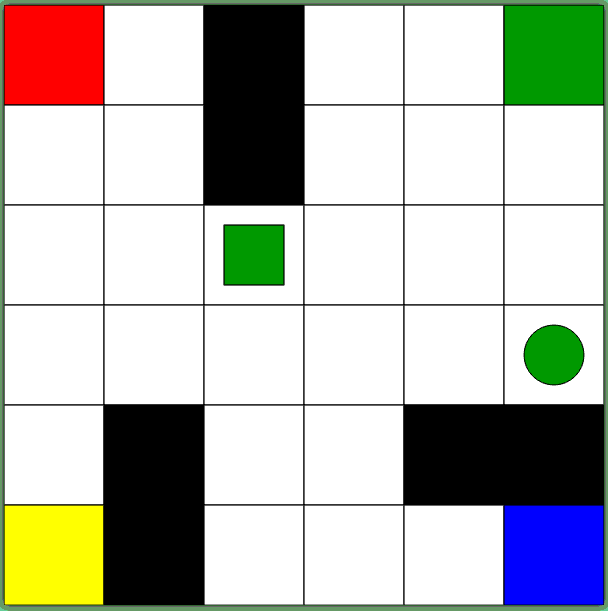

# Mystery Game

The aim of the game is to win the game. You have six actions available, which can be executed by pressing keys 1, 2, 3, 4, 5, and 6. You need to learn what the actions do and what the rewards are. No other instructions are given, but you will know when you receive any rewards/points. Try to play the game and see if you can win. 

